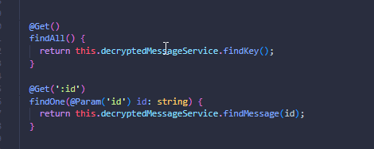
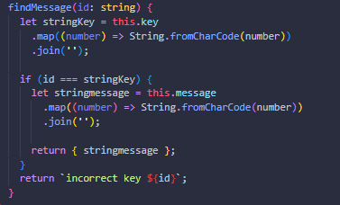
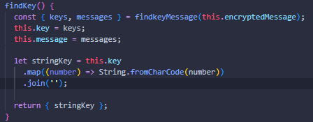
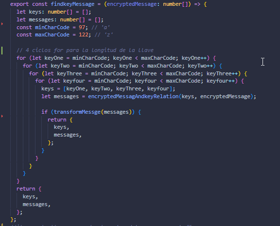
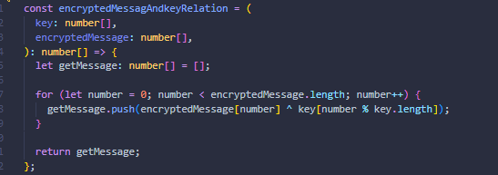
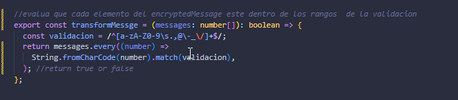
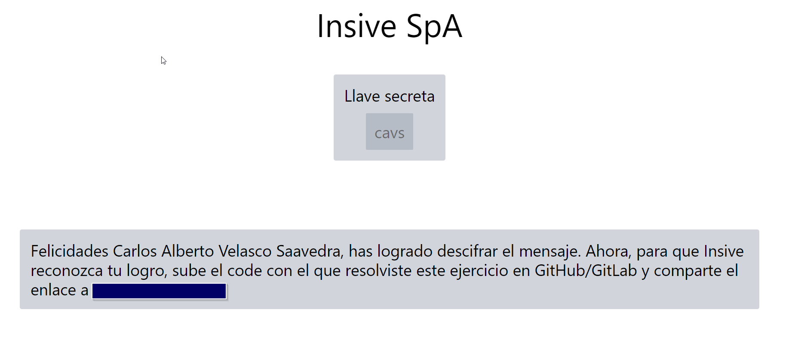

<p align="right">
  <a href="http://nestjs.com/" target="blank"></a>
</p>


# Ejecutar en desarrollo

1. clonar el repositorio.

2. Ejecutar.

    ```
    npm install
    ```
3. Tener Nest CLI instalado.

    ```
    npm i -g @nestjs/cli
    ```
4. Levantar la aplicacion

    ~~~
    npm run dev
    ~~~

## Stack  usado
* Nestjs

## Rutas
1. llave secreta
    ```
    GET : http://localhost:3000/decrypted-message

    ```
2. mensaje
    ```
    GET : http://localhost:3000/decrypted-message/<llave secreta>

    ```

  
## Procesos
 1. tenemos los manejdaro de rutas
    ```
    src/decrypted-message/decrypted-message.controller.ts
    ```
        

   *  findAll(): Este método maneja solicitudes GET a la ruta base (/decrypted-message). Delega la solicitud al método findKey().

   * findOne(@Param('id') id: string): Este método maneja solicitudes GET a una ruta con un parámetro dinámico (/decrypted-message/:id). Utiliza el decorador @Param('id') para extraer el valor del parámetro id de la URL de la solicitud y pasarlo como argumento al método findMessage().

   

 2. tenemos los service donde esta parte de la logica logica

    ```
    src/decrypted-message/decrypted-message.service.ts
    ```
    se encarga de trabajar con el mensaje cifrado, sus funciones:

    * Encontrar la clave utilizada para cifrar un mensaje.

        

    * Recuperar el mensaje descifrado utilizando una clave proporcionada.

        

 3. helper findkeyMesaage.helper.

 
    ```
    src/decrypted-message/helper/ findkeyMesaage.helper.ts
    ```
    La lógica  que ayuda a el descifrado de la clave y mesaje.
    
    1. iterar todas las convinaciones posibles  ``findkeyMessage``.

    

    2. Para cada combinación, usa ``encryptedMessagAndkeyRelation`` para descifrar el mensaje con la clave actual.
    

    3. Usa ``transformMessge`` para comprobar si el mensaje descifrado es válido (solo contiene caracteres permitidos).

    


    ## Codifo Front 
    ```
    https://github.com/alberto8812/Insive-Mensaje-Oculto-front.git
    ```
    ## Visualizar en el front end

    